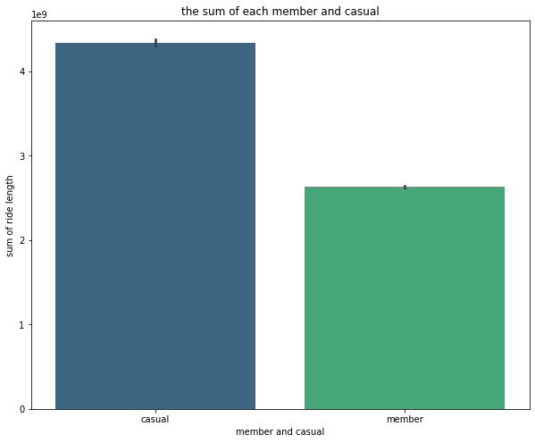
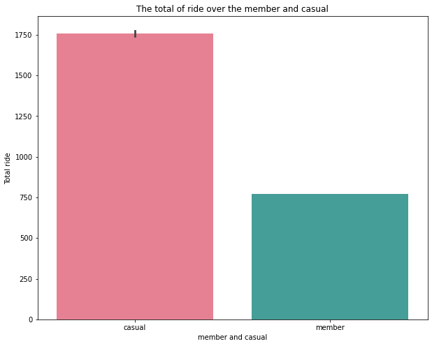
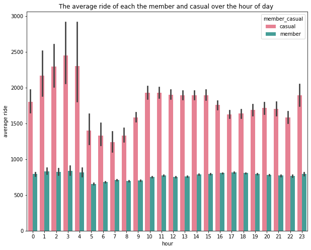
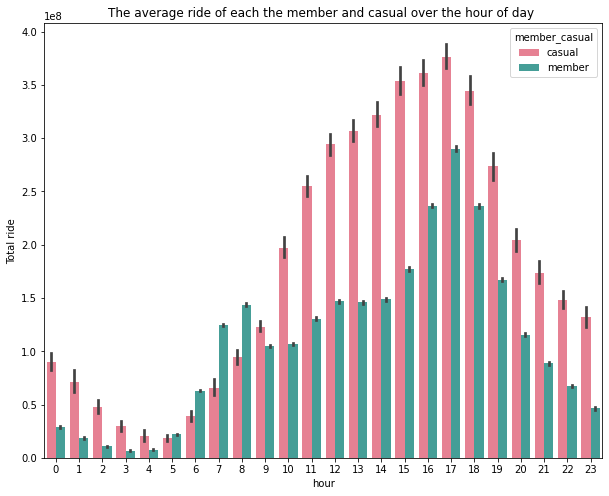
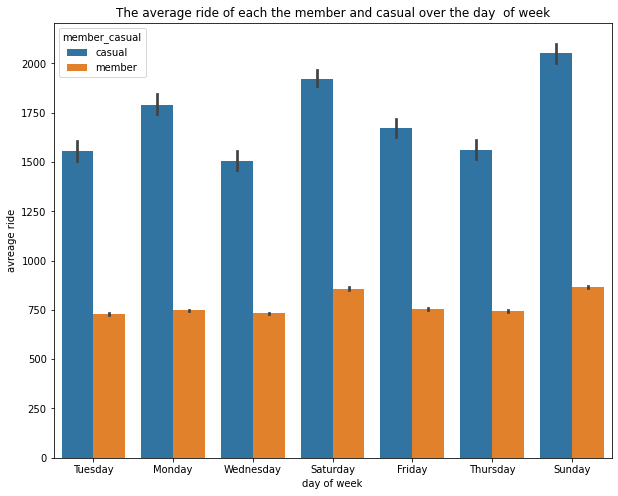

Case Study: How Does a Bike-Share Navigate Speedy Success?
============================================================
## introduction 
This is a case study about the **Cyclistic bike-share analysis**, in this case, I will be analyzed by following the steps of **the data analysis process: ask, prepare, process, analyze, share, and act**.

### About the Company
In 2016, **Cyclistic** launched a successful bike-share offering. Since then, the program has grown to a fleet of 5,824 bicycles that are geotracked and locked into a network of 692 stations across Chicago. The bikes can be unlocked from one station and returned to any other station in the system at any time.

### Business task:
Analyze the Cyclistic data set for one year to understand how annual members and casual riders use Cyclistic bikes differently.

### Stakeholders:

**Lily Moreno**: The director of marketing. Moreno is responsible for the development of campaigns and initiatives to promote the bike-share program.
**Cyclistic marketing analytics team: ** A team of data analysts who are responsible for collecting, analyzing, and reporting data that helps guide Cyclistic marketing strategy.
**Cyclistic executive team**: The executive team will decide whether to approve the recommended marketing program.

### Deliverables:

> - A description of all data sources used
> - Documentation of any cleaning or manipulation of data
> - A summary of the analysis
> - Supporting visualizations and key findings
> - Top three to four recommendations based on the analysis

## STEP ONE: **ASK**
**Lily Moreno**(The director of marketing and my manager) has set a clear goal: Design marketing strategies aimed at converting casual riders into annual members. To do that, however, the marketing analyst team needs to better understand how annual members and casual riders differ, why casual riders would buy a membership, and how digital media could affect their marketing tactics. Moreno and her team are interested in analyzing the Cyclistic historical bike trip data to identify trends by asking three questions that will guide the future marketing program:

**1.** How do annual members and casual riders use Cyclistic bikes differently?

**2.** Why would casual riders buy Cyclistic annual memberships?

**3.** How can Cyclistic use digital media to influence casual riders to become members?

**Moreno** has assigned you the first question to answer: **How do annual members and casual riders use Cyclistic bikes differently?**, to answer this question I should prepare data by collecting it from a trusted source.

## STEP TWO: PREPARE
the raw data is located in [here](https://divvy-tripdata.s3.amazonaws.com/index.html), and it is publicly available under this [license](https://ride.divvybikes.com/data-license-agreement) with some privacy restriction.


**ROCCC data**

> - **Reliable**: this dataset is complete, accurate and it is from a trusted source

> - **Original:** the data collected from the first part means it is Original 

> - **Comprehensive:** the data contain information that we need to do the analysis

> -  **Current:** I choose the period from September 2021 to August 2022 

> - **Cited:** the data is [here](https://divvy-tripdata.s3.amazonaws.com/index.html)

before downloading the raw data we need to install some dependencies

***install and import the libraries***

```
import matplotlib.pyplot as plt 
import seaborn as sns
import pandas as pd
import numpy as np
import gc

```
1. Pandas is python data analysis library, you can check the [documentation](https://pandas.pydata.org/docs/)
2. Numpy is python library for scientific computing, again you can see more in the [documenatation](https://numpy.org/doc/stable/)
3. Matplotlib is pythonn data visualization library, see [more](https://matplotlib.org/)
4. Seaborn is a Python data visualization library based on matplotlib. It provides a high-level interface for drawing attractive and informative statistical graphics and here is the [documentation](https://seaborn.pydata.org/).
5. gc is This module provides an interface to the optional garbage collector. It provides the ability to disable the collector, tune the collection frequency, and set debugging options. and here is a [documantation](https://docs.python.org/3/library/gc.html)


***then, we downloaded 12 the dataset that are from September 2021 to August 2022***

``` 
df_01 = pd.read_csv("/content/drive/MyDrive/dataset/divvy-tripdata_202109.csv")
df_02 = pd.read_csv("/content/drive/MyDrive/dataset/divvy-tripdata_202110.csv")
df_03 = pd.read_csv("/content/drive/MyDrive/dataset/divvy-tripdata_202111.csv")
df_04 = pd.read_csv("/content/drive/MyDrive/dataset/divvy-tripdata_202112.csv")
df_05 = pd.read_csv("/content/drive/MyDrive/dataset/divvy-tripdata_202201.csv")
df_06 = pd.read_csv("/content/drive/MyDrive/dataset/divvy-tripdata_202202.csv")
df_07 = pd.read_csv("/content/drive/MyDrive/dataset/divvy-tripdata_202203.csv")
df_08 = pd.read_csv("/content/drive/MyDrive/dataset/divvy-tripdata_202204.csv")
df_09 = pd.read_csv("/content/drive/MyDrive/dataset/divvy-tripdata_202205.csv")
df_10 = pd.read_csv("/content/drive/MyDrive/dataset/divvy-tripdata_202206.csv")
df_11 = pd.read_csv("/content/drive/MyDrive/dataset/divvy-tripdata_202207.csv")
df_12 = pd.read_csv("/content/drive/MyDrive/dataset/divvy-tripdata_202208.csv")

```

#### 1.Before wrangling dataset we will concatenate all the datatset into one then remove the 12 dataset 

we doing that because we need more RAM

```
#concate the all dataset into one 
df = pd.concat([df_01, df_02, df_03, df_04, df_05, df_06, df_07, df_08, df_09, df_10,
               df_11, df_12])
   
```
Save df to  pickle, for computation reasons then read pickle file 

```
#save df to pickle 
df.to_pickle("./bike.pkl")

```
```
# read pickle file 
bike = pd.read_pickle('bike.pkl')
bike.head()

```
delete all df_01, to df_12 and df 

```
delete all 
del df_01
gc.collect()
 
del df_02
gc.collect()

del df_03
gc.collect()

del df_04
gc.collect()

del df_05
gc.collect()

del df_06
gc.collect()

del df_07
gc.collect()

del df_08
gc.collect()

del df_09
gc.collect()

del df_10
gc.collect()

del df_11

gc.collect()

del df_12
gc.collect()

del df
gc.collect()

```
2. see if we have the same columns in all dataset

```
#bike columns
bike.columns 

```
3. A Structure dataset, we want to see each column and it's a datatype

```
#dtypes
bike.dtypes

```
dataset have the same columns ***(ride_id, rideable_type, started_at, ended_at, start_station_name, start_station_id, end_station_id, start_lat, start_lng, end_lat, end_lng, member_casual)***,  I didn't to rename some dataset's becaue they have same columns name

## STEP THREE: PROCESSING

After combining all datasets into one, first clean the df dataset by the filter's out the duplicated value and looking for missing numeric values, after that, I will add more columns that beneficial to my analysis.

#### 1- remove the duplicated value

```
#df, ride_id duplicated
print(sum(bike['ride_id'].duplicated()))

```

-as you can see there's no duplication in ride_id, so now let's keep forward and deal with the missing value

#### 2- check if there is a missing value.

```
#df missing value for ride_id
print(sum(bike.ride_id.isnull()))

#df missing value for rideable_type
print(sum(bike.rideable_type.isnull()))

#df missing value for started_at 
print(sum(bike.started_at.isnull()))

#df missing value for ended_at
print(sum(bike.ended_at.isnull()))

#df missing value for start_station_name
print(sum(bike.start_station_name.isnull()))

#df missing value for start_station_id
print(sum(bike.start_station_id.isnull()))

#df missing value for end_station_name
print(sum(bike.end_station_name.isnull()))

#df missing value for end_station_id
print(sum(bike.end_station_id.isnull()))

#df missing value for start_lat
print(sum(bike.start_lat.isnull()))

#dfmissing value for start_lng
print(sum(bike.start_lng.isnull()))

#dfmissing value for end_lat
print(sum(bike.end_lat.isnull()))

#df missing value for end_lng
print(sum(bike.end_lng.isnull()))

#df missing value for member_casual
print(sum(bike.member_casual.isnull()))

```
The df columns missing value is **start_station_name, start_station_id, end_station_name, end_station_id, end_lat, end_lng**

 #### 3- filling the missing 
 let's filling each dataset missing value by first looking for the datatype and filling the null in terms of thier datatype.
 
 ```
 #fillna
bike["start_station_name"].ffill(axis=0, inplace=True)
bike["start_station_name"].bfill(axis=0, inplace=True)
bike["start_station_id"].ffill(axis=0, inplace=True)
bike["start_station_id"].bfill(axis=0, inplace=True)
bike["end_station_name"].ffill(axis=0, inplace=True)
bike["end_station_name"].bfill(axis=0, inplace=True)
bike["end_station_id"].ffill(axis=0, inplace=True)
bike["end_station_id"].bfill(axis=0, inplace=True)
bike["end_lat"].ffill(axis=0, inplace=True)
bike["end_lat"].bfill(axis=0, inplace=True)
bike["end_lng"].ffill(axis=0, inplace=True)
bike["end_lng"].bfill(axis=0, inplace=True)

```

##### 4- Data varification
check if there is duplication and missing value 

```
#duplucation
print(sum(bike['ride_id'].duplicated()))

```

```
#df missing value for ride_id
print(sum(bike.ride_id.isnull()))

#df missing value for rideable_type
print(sum(bike.rideable_type.isnull()))

#df missing value for started_at 
print(sum(bike.started_at.isnull()))

#df missing value for ended_at
print(sum(bike.ended_at.isnull()))

#df missing value for start_station_name
print(sum(bike.start_station_name.isnull()))

#df missing value for start_station_id
print(sum(bike.start_station_id.isnull()))

#df missing value for end_station_name
print(sum(bike.end_station_name.isnull()))

#df missing value for end_station_id
print(sum(bike.end_station_id.isnull()))

#df missing value for start_lat
print(sum(bike.start_lat.isnull()))

#dfmissing value for start_lng
print(sum(bike.start_lng.isnull()))

#dfmissing value for end_lat
print(sum(bike.end_lat.isnull()))

#df missing value for end_lng
print(sum(bike.end_lng.isnull()))

#df missing value for member_casual
print(sum(bike.member_casual.isnull()))

```

##### 5. create more columns
5.1. converting the started_at and ended_at DateTime datatype and splitting into the day, month, year, and day of the week.

```
#convert the dataframe
#started_at, ended_at to datetime 
bike['started_at'] = pd.to_datetime(bike['started_at'])
bike['ended_at'] = pd.to_datetime(bike['ended_at'])
bike['day'] = bike['started_at'].dt.day
bike['month'] = bike['started_at'].dt.month
bike['year'] = bike['started_at'].dt.year
bike['day_of_week'] = bike['started_at'].dt.day_name()
bike['hour'] = bike['started_at'].dt.hour
bike['minute'] = bike['started_at'].dt.minute
bike['second'] = bike['started_at'].dt.second
bike.head()

```

5.2. Add another column to ride_length by calculating the difference between ended_at and started_at, convert the datatype of ride_length, and than check if ride_length is float

```
#difference betwee the ended_at and started_at
bike['ride_length'] = bike['ended_at'] - bike['started_at']
bike['ride_length'] = bike['ride_length'].dt.total_seconds()

#to_numeric, head, dtypes
bike['ride_length'] = bike['ride_length'].astype(np.float64)
print(bike.head())
print(bike.dtypes)

```
chek if there is negative value in ride_length, and fixed it 

```
#error's in ride_length 
sum(bike['ride_length'] < 0)

#convert the negative to positive 
bike['ride_length'] = bike['ride_length'].abs()

```

6 -  let's see if more then casual and member in member_casual, and I doing some calculation.

```
set(bike['member_casual'])

```

In member_casual there are two category object, the casual and member.

After this long step of processing data, now I can do the analysis step.

 ## STEP FOUR: ANALYSIS
 
-Before jumping to the analysis, let's take the summary, structure, number of columns.
 

 ```
 #head, describe(), dtypes, columns
print(bike.head())
print(bike.describe())
print(bike.dtypes)
print(bike.columns)

```

How many percentage of each category in member_casual? 
but before seen the percentage of each category we should convert the datatype of member_casaul first

```
#convert to category 
bike['member_casual'] = bike['member_casual'].astype("category")
bike.dtypes

```
the count and the percentage of each category in member_casual

```
print(bike['member_casual'].value_counts())
print(len(bike['member_casual']))
count = bike['member_casual'].value_counts()
lenth = len(bike['member_casual'])
print((count/lenth)*100)

```

-**FINDING (1)**

- In general, in the  above the casual have great (mean, max, sum) values, and they also varied (standard deviation) than members even if the count and percentage of member are more by near to 58% of the member greater than casual, maybe this is because there are a few users casuals (42%) using the bike's for a long ride but they are not a member.

Using **pivot table** to sumarise the mean, sum, std, max and min 

```
table = pd.pivot_table(bike, values=['ride_length'], index=['member_casual'],
                     aggfunc=[np.mean, np.sum, np.std, max, min])
print(table)

```
-**FINDING (2)**
- > here in the table above we can take an intuition about why the mean of casual is greater than member but the number of rides is way less than that of the member, that's because the ride length sum of casual(4339343000) is greater of the ride sum of member(2633702000). conversely, the length of rides of casual is less than the ride length of the member, this explains why the mean of the casual ride is greater than that of member.

chart(1): the sum of each member and casual

```
plt.figure(figsize=(10,8))
ax = sns.barplot(x='member_casual', 
            y='ride_length', data=bike, 
            estimator=sum, palette='viridis')

ax.set(title="the sum of each member and casual", xlabel = "member and casual", ylabel = "sum of ride length")

```



-**FINDING (3)**
- > As you can see in chart(1)  above, the sum of casual are  more than the sum of casual.

**chart(2)**

- the mean of ride length of each member and casual.

```

plt.figure(figsize=(10,8))
ax = sns.barplot(x='member_casual', 
                 y='ride_length',  
                  data=bike, palette="husl")
ax.set(title = "The total of ride over the member and casual", xlabel = "member and casual", ylabel = "Total ride")

```



-**FINDING (4)**

- > In chart(2), the mean ride length of the casual is up to 1500, while the member didn't reach 1000.

Now let's see the comparison of ride length in member and casual at hours.

```
table = bike.groupby(['hour', 'member_casual']).agg({'ride_length':['sum', 'mean']})
table.sort_values

```

**-FINDING (5)**

- The sum value of casual is **376053750** at five pm, (**17:00**), and the mean of it is 2448.15 at three am (**3**)
- The max vaule of member is **290209836** at five pm (**17:00**), and the mean value of the member is 838.9 , the same as casual at three am (**3**)

Lets make visual chart of what we say above. 
by first the mean or the average ride of both member and casual over the hour of a day, then seen the sum ride of each member and casual over hour of a day. 

chart(3): The average ride of each the member and casual over the hour of day.

```
plt.figure(figsize=(10,8))
ax = sns.barplot(x='hour', 
                 y='ride_length', hue='member_casual',  
                  data=bike, palette="husl")
ax.set(title = "The average ride of each the member and casual over the hour of day ", 
       xlabel = "hour", ylabel = "average ride")

```


-**FINDING (6)**.
- > In the chart(3): there some pickes specaily in 3 am with highest error bars varaition, 
and that indicate to the high demand from casual customer 

chart(4): The sum ride of each the member and casual over the hour of day.

```
plt.figure(figsize=(10,8))
ax = sns.barplot(x='hour', 
                 y='ride_length', hue='member_casual',  
                  data=bike, palette="husl", estimator=sum)
ax.set(title = "The average ride of each the member and casual over the hour of day ", 
       xlabel = "hour", ylabel = "Total ride")
       
```


-**Finding(7):**

- > In the chart(4): the demand keep increasing from 7 am to 8 pm for both member and casual. 

-compare the casual and member at weekday.

```
table = bike.groupby(['day_of_week', 'member_casual']).agg({'ride_length':['sum', 'mean']})
table.sort_values

```

-**Finding(8):**
- > the max sum value for casual is 980528463 at Saturday, and mean at 2051.2 at Sunday.

-> the max sum value for member is 400297111  in Wednesday and the mean also at Sunday by 865.52

chart(5): The average ride of each the member and casual over the days of week.

```
plt.figure(figsize=(10,8))
ax = sns.barplot(x='day_of_week', 
                 y='ride_length', hue='member_casual',  
                  data=bike, palette="tab10")
ax.set(title = "The average ride of each the member and casual over the day  of week", 
       xlabel = "day of week", ylabel = "avreage ride")
     
```



